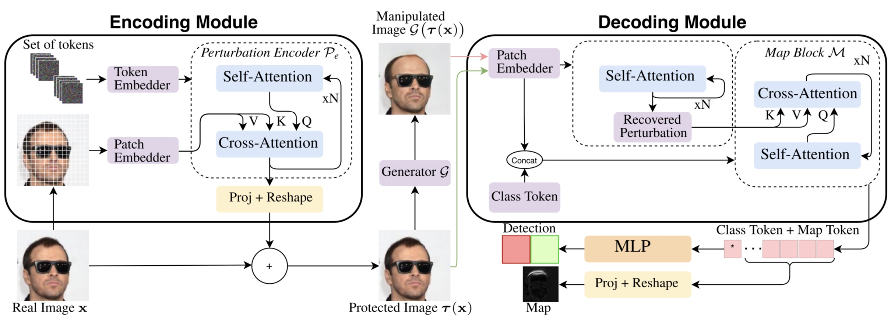

# PADL
Repository for the paper ["Perturb, Attend, Detect and Localize (PADL): Robust Proactive Image Defense"](https://ieeexplore.ieee.org/abstract/document/10980274/)

PADL is a proactive defense framework to safeguard images against manipulations performed by generative models. Unlike traditional passive detection methods, which attempt to identify manipulations after they occur, PADL embeds image-specific protection signals directly into the image before sharing it.

# Overview
<p align="center">
 
</p>
PADL architecture overview: the encoding module creates a specific perturbation and adds it to a real image for protection. The decoding module first estimates the perturbation and then uses it to perform manipulation detection and localization.

# Trained Models
You can download the pretrained checkpoints of all our models [here](https://drive.google.com/drive/folders/1RsqMcG_D9s6u9JrLkoGDgNxJj-e1rr0U?usp=share_link)

# Dataset
We rely on the test set split used in MaLP. 
Please download the dataset directly from their repository:
* [MaLP Repository](https://github.com/vishal3477/pro_loc)

# Authors
* Filippo Bartolucci
* Iacopo Masi
* Giuseppe Lisanti

# Cite
If you use this source code please cite the following works:


**[Image Specific Protection Against Manipulation](https://github.com/filippobartolucci/ImSP/)**
```
@InProceedings{ImSP,
author="Bartolucci, Filippo
and Lisanti, Giuseppe",
editor="Rodol{\`a}, Emanuele
and Galasso, Fabio
and Masi, Iacopo",
title="Image Specific Protection Against Manipulation",
booktitle="Image Analysis and Processing -- ICIAP 2025",
year="2026",
publisher="Springer Nature Switzerland",
address="Cham",
pages="660--671",
}
```

**Perturb, Attend, Detect and Localize (PADL): Robust Proactive Image Defense**
```
@ARTICLE{10980274,
  author={Bartolucci, Filippo and Masi, Iacopo and Lisanti, Giuseppe},
  journal={IEEE Access}, 
  title={Perturb, Attend, Detect, and Localize (PADL): Robust Proactive Image Defense}, 
  year={2025},
  volume={13},
  pages={81755-81768},
  doi={10.1109/ACCESS.2025.3565824}}

```
